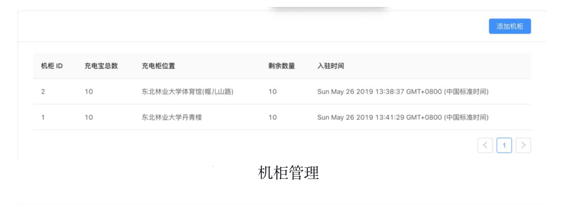
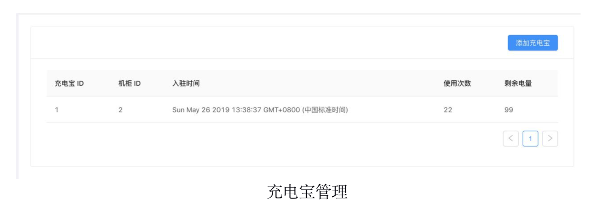
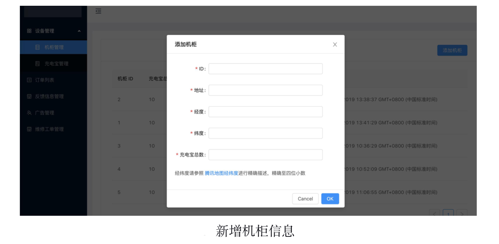
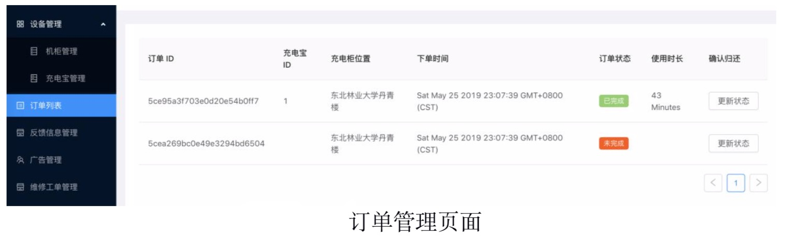
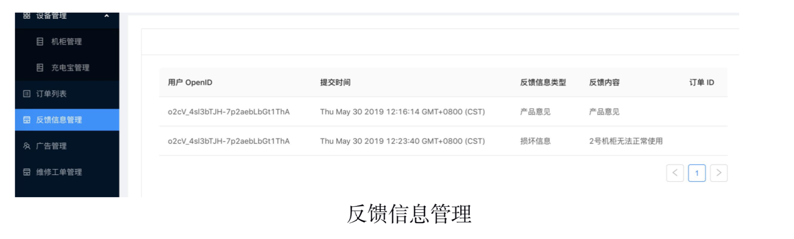
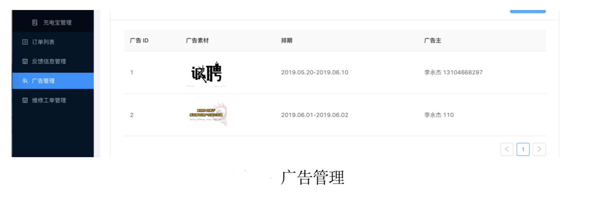
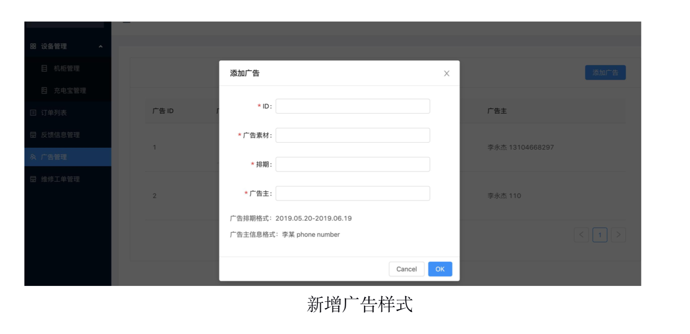

# 校园共享充电管理系统

- 前端开发选择 Vue 框架
- 后端使用 NodeJS 和 MongoDB 数据库

 ### 项目描述：毕业设计项目后端系统，设备管理、订单管理、反馈信息管理、广告管理、维修工单。在可持续运营的前提下，增加盈利能力。
 >> - 后端选择 Node + mongodb，前端选择 Vue，前后端分离开发
 >> - 使用 vue cli 作为脚手架并加入自定义的配置

    
    
    
    
    
    
    

